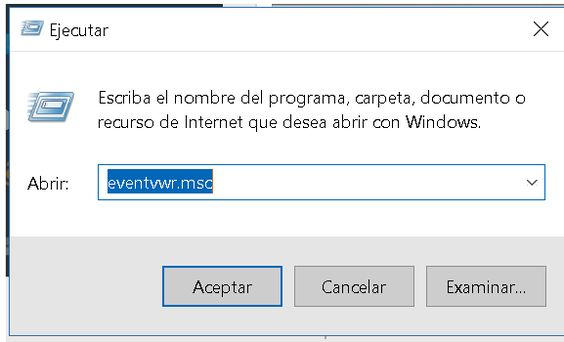
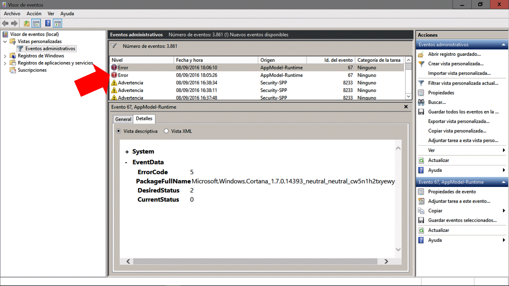
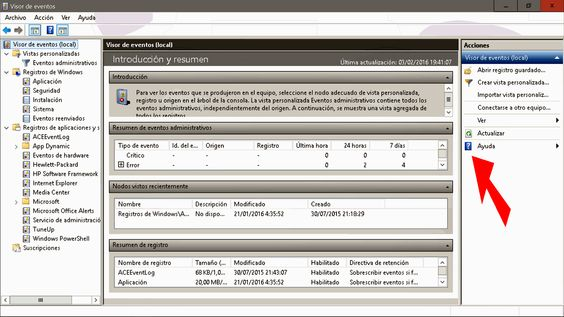

# Visor de eventos
El visor de eventos de Windows 10 muestra un histórico de los eventos relevantes que suceden mientras nuestro equipo funciona.
Ejemplos de eventos del sistema son:

* Las actualizaciones automáticas.
* Los cierres inesperados de programas.
* Incidentes con el hardware.
* Eventos de los controladores de dispositivos.
	* Errores o fallos en la ejecución de los mismos.
* Servicios que se arrancan o detienen.
* Eventos de seguridad del sistema.
* Información de accesos.

Para abrirlo teclea **Visor** una vez pulsado el botón **Inicio** o ejecuta el comando **eventvwr.msc**.

Observaras que el Visor de eventos se organiza como un árbol de directorios del que cuelgan subcarpetas:

* Vistas personalizadas con Eventos administrativos.
* Registros de Windows divididos en Aplicación, Seguridad, Instalación, Sistema y Eventos reenviados.
* Registros de aplicaciones y servicios, los cuales incluyen eventos de software y de hardware.
* Suscripciones.

En la parte central de la ventana del Visor de eventos puedes acceder a los eventos particulares y en el panel Acciones de la derecha tienes disponibles todas las acciones que de manera contextual puedes realizar con los elementos seleccionados.

