## Configuracion TCP/IP

## Windows

### ipconfig

Muestra la información de nuestro equipo como
>**Descripción** - Nombre del adaptador o tarjeta de red utilizado en la conexión.

>**Dirección IPV4** - Es la dirección IP/mascara asignada al equipo en la red local.

>**Puerta de enlace predeterminada** - Es la dirección IP del equipo que funciona como router y que tiene acceso a internet.

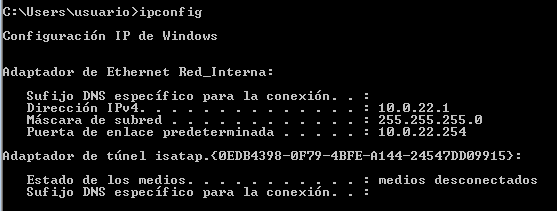

### ipconfig /all
Muestra la información de nuestro equipo como:
>**Descripción** - Nombre del adaptador o tarjeta de red utilizado en la conexión.

>**Dirección IPV4** - Es la dirección IP/mascara asignada al equipo en la red local.

>**Puerta de enlace predeterminada** - Es la dirección IP del equipo que funciona como router y que tiene acceso a internet.

>**Servidores DNS** - Son los servidores con los cuales el equipo anterior gestiona en la red la relación nombre de dominio/Dirección IP de las paginas solicitadas.

>**Estado de DHCP** - Configuración dinámica de host, eso significa que siempre se utilizara una dirección IP estática o fija entre el equipo y el host.

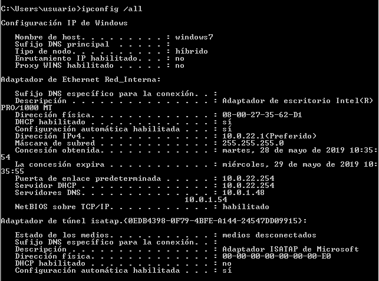

### getmac
Este comando habilita al administrador para poder mostrar la dirección MAC de uno o mas adaptores de red de un equipo.

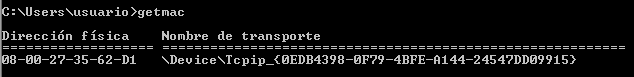

## Linux
### ifconfig
La orden ifconfig se utiliza para configurar y mostrar los interfaces de red de Linux. Se indican varios parámetros:

* La dirección IP de la maquina.
* La mascara de la red local.
* La dirección de broadcast.
* La dirección Mac.

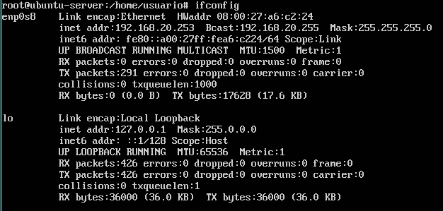

### ifconfig -a
La orden ifconfig -a se utiliza para configurar y mostrar los interfaces de red en Linux incluyendo las interfaces que no están activas.

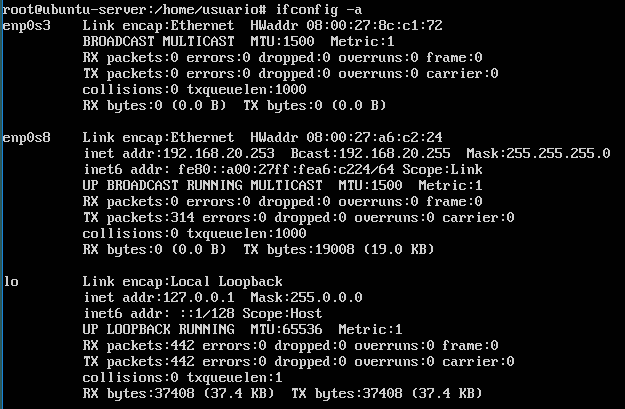

### ip address show
La orden ip address show se utiliza para configurar y mostrar los interfaces de red de Linux incluyendo las que no están activas. Se indican varios parámetros:

* La dirección IP de la maquina.
* La mascara de la red local.
* La dirección de broadcast.
* La dirección Mac.

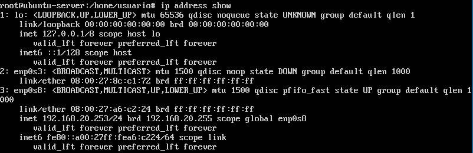

### ip address list
La orden ip address show se utiliza para configurar y mostrar los interfaces de red de Linux incluyendo las que no están activas. Se indican varios parámetros:

* La dirección IP de la maquina.
* La mascara de la red local.
* La dirección de broadcast.
* La dirección Mac.

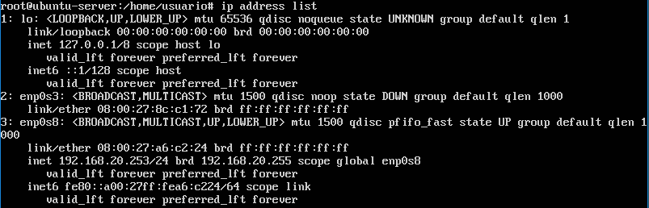

## Mikrotik
### interface print
La orden **interface print** nos muestra las de todas las tarjetas de red que tiene.

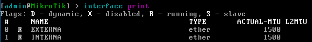

### ip address print
La orden **ip address print** nos muestra las IPs de todas las tarjetas de red que tiene asi como tambien las networks de cada tarjeta de red.

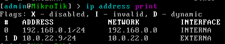

# Enrutamiento/Tabla de rutas
## Windows
### route print
Nos muestra todos los destinos de red asi como tambien la mascara de red, la puerta de enlace y la interfaz de la tarjeta de red.

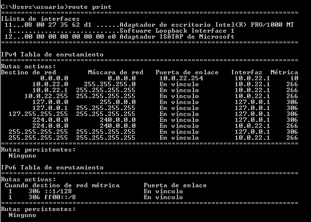

## Linux
### netstat -r
El comando **netstat -r** nos muestra las network de nuestros equipos asi como tambien las puertas de enlace.

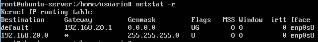

### route -n
El comando **route -n** nos muestra las network de nuestros equipos asi como tambien las puertas de enlace.

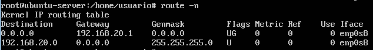

### ip route show
El comando **ip route show** nos muestra las network de nuestros equipos asi como tambien las puertas de enlace.

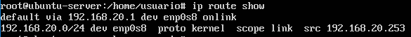

## Mikrotik
### ip route print
El comando **ip route print** nos muestra las network de cada tarjeta de red.

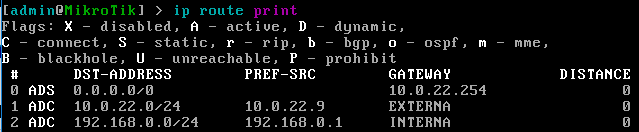
