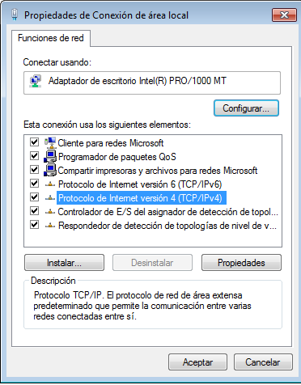

	TCP/IP Windows
Para configurar la configuración TCP/IP de windows de hace gráficamente, de tal forma que iríamos a la zona inferior derecha y en la pantalla con un cable de Internet (rj45)

Le daremos click derecho y abrimos el centro de redes y recursos compartidos.

Se nos abrirá una pantalla en la cual tendremos que darle a propiedades en la zona inferior izquierda y buscaremos el Protocolo de Internet versión 5 (TCP/IPv4)

Dentro de esta pantalla, en primer lugar podremos poner la IP de forma automática (DHCP), la opción de usar la siguiente dirección IP: podremos configurar la IP estática que queremos, la Máscara de subred y la puerta de enlace, por si tenemos una ip privada asignada para el equipo y continuación pondremos la DNS como anteriormente, si automática o estática.

En la configuración avanzada de hace lo mismo añadiendo el WINS.

-Comandos de windows de comprobación:

ipconfig

En el cual nos aparecerá, El sujido  DNS,Direcion IPv6 Local, IPv4, mascara de subred y puerta de enlace. como cosas importantes.

ipconfig/all

Viendo el comando ya podréis entender que es una extensión del anterior, entonces nos saldrá lo mismo que anteriormente mas, el nombre de host, sufijo DNS, servidor dhcp, direccion fisica y los DNS, como lo mas importante

getmac

Con este comando veremos la Dirección física (MAC) y el nombre del transporte 

	TCP/IP Linux

En la parte superior derecha encontraremos este icono:

Le daremos click  y editar conexiones.

Cuando se nos abra este meno:

elegiremos la red y le daremos a editar, se nos abrirá un menu y nos vamos a la pestaña IPV4.

Aqui podremos como en windows. en Método elijemos DHCP o Static, si ponemos static configuraremos la direción, mascara de red y puerta de enlace. abajo podremos elegir la DNS.

-Comandos de linux para ver la configuracion

Ifconfig

Igual que el ipconfig de windows, te muesta cada una de las tarjetas con su nombre, su ip,mascara...

ip address show

Te muestra la ip con la que estas trabajando.

ip address list

Con este comando puedes encontrar la ip y la MAC

	Comandos Mikrotik

-ip address print

Este comando nos enseña las conexiones que tenemos, tanto la ip con su mascara, como el network y la interface.

-interface print 

Nos muestra los nombres de las redes que tenemos

	Enrutamiento / tabla de rutas	

	Comandos Windows

-Route print

Este comando se utiliza para imprimir rutas y también poder ver las rutas activas.

	Comandos Linux

-netstat -r

Te enseña las tablas de rutas y el -r las principales.

-route - n

Te enseña las posibles rutas y con -n las principales, es un comando parecido a netstat

-ip route show

Te enseña cada tarjeta de red con su configuración básica

	Comandos Mikrotik

-ip route print 

Te enseña la configuración básica de las tarjetas de red

Hecho por: Ivan
