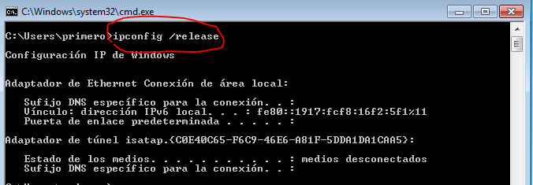
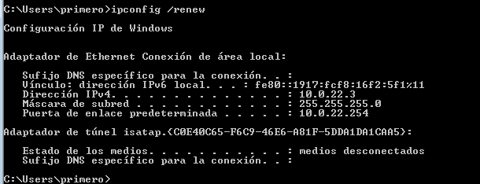
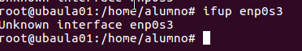

#Guia DHCP

**DHCP** permite que los equipos puedan obtener la configuracion de red, evitando que el administrador tenga que configurar manualmente los parametros **TCP/IP** de cada equipo.
>**Comandos DHCP**
>>**En Windows**

* Ipconfig /release

Libera la dirección IP.

* Ipconfig /renew

Renueva la dirección IP.

>>**En Linux**

* Ifdown enp0s3

Sirve para desconfigurar o desconectar las interfaces de red, aunque suele fallar bastante

* Ifup enp0s3

Se utiliza para activar interfaces de red, aunque como ifdown suele dar fallos.

* dhclient/dhclient -r

te permite liberar **(usando el parametro -r)** la IP actual y obtener una nueva desde el servidor **DHCP** de tu sistema

autor: juanelessarjorrin

#Y HASTA AQUI EL TUTORIAL DE DHCP 

#GRACIAS

