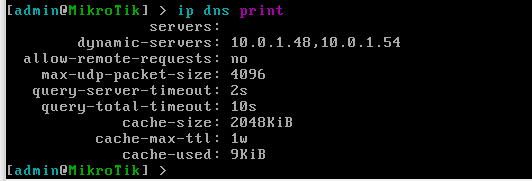

#GUIA DNS

Los **DNS** son las siglas que forman la denominación **Domain Name System** y además de apuntar los dominios al servidor correspondiente, nos servirá para traducir la dirección real.

>**Comandos DNS**
>>**En Windows**

* Nslookup:

Es un programa utilizado para saber si el **DNS** está resolviendo correctamente los nombres y las IPs.

>>**En Linux**

* Nslookup:

Funciona y sirve para lo mismo que en Windows.

* dig:

Es una herramienta para realizar consultas a los servidores **DNS** para solicitar información sobre direcciones de host, intercambios de correo, etc...

* Host:

Permite realizar busquedas en **DNS**

* Cat y /etc/resolv.conf

El comando cat sirve para leer datos y mostrar su contenido, y el archivo /etc/resolv.conf sirve para cambiar los servidores de **DNS** que nuestro sistema utiliza para resolver el nombre de dominio.

>>**En Mikrotik**

* Ip dns print

Sirve para mostrar toda la configuración del **DNS** del mikrotik.

autor: juanelessarjorrin

#GUIA DNS 
#FIN